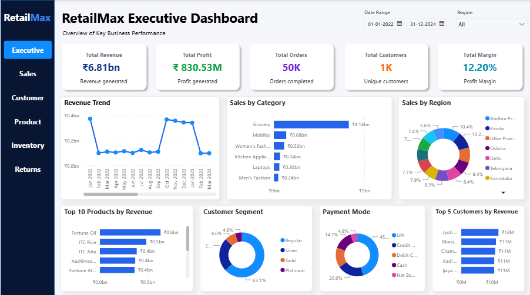
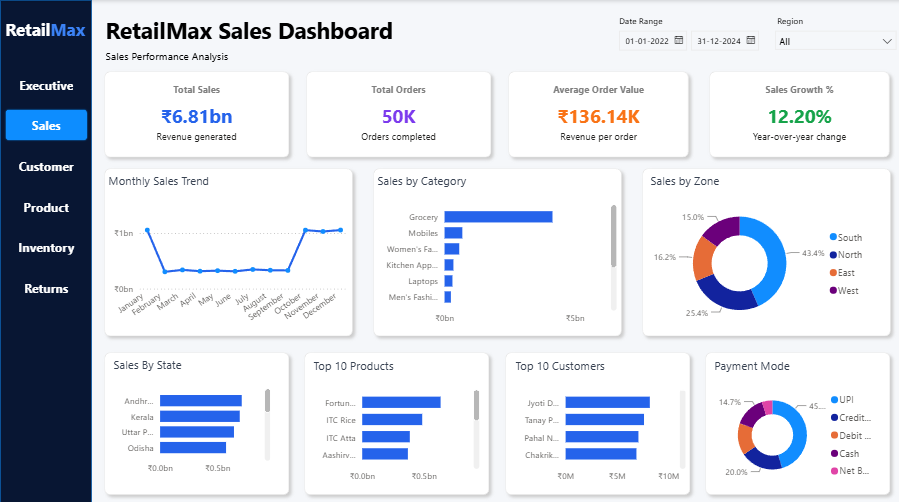
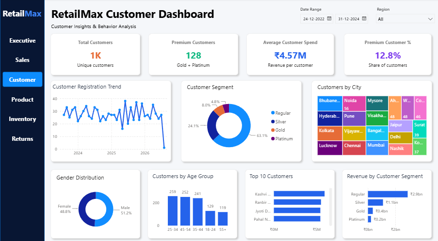
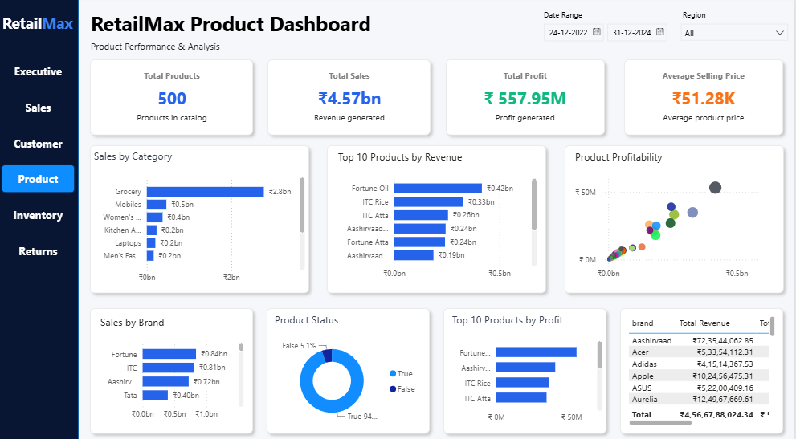
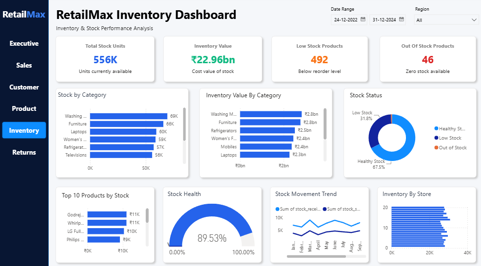
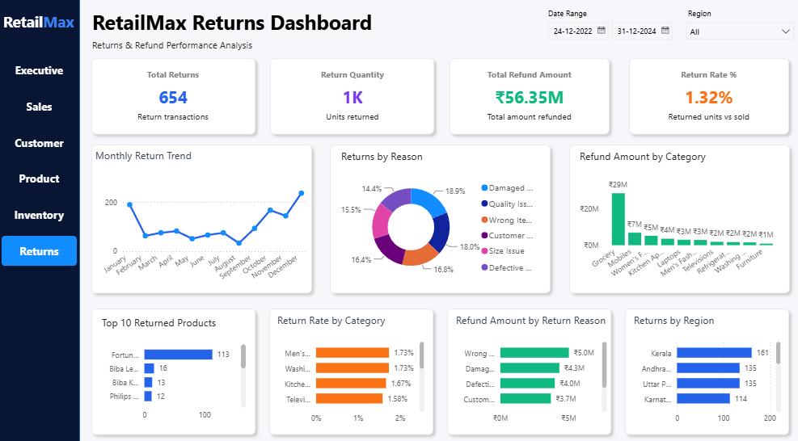
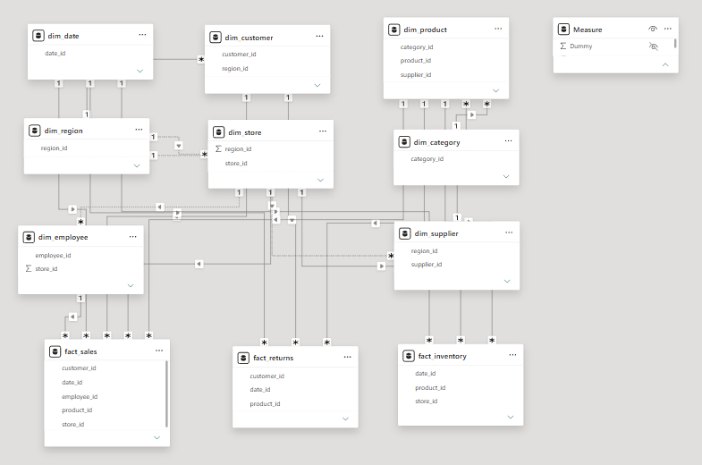

# 🛍️ RetailMax Business Intelligence Project

## 📸 Executive Dashboard



---

## 📈 Sales Dashboard



---

## 👥 Customer Dashboard



---

## 🛍️ Product Dashboard



---

## 📦 Inventory Dashboard



---

## 🔄 Returns Dashboard



---

## 📊 Data Model



---

# 📌 Project Overview

RetailMax is an end-to-end Business Intelligence project built using **Python, MySQL, SQL, Power BI, DAX, Power Query, Git, and GitHub**.

The project demonstrates the complete analytics workflow from generating retail data to designing an interactive executive dashboard that provides business insights for decision-makers.

---

# 🚀 Tech Stack

| Technology | Purpose |
|------------|---------|
| Python | Generate retail datasets |
| Pandas | Data generation & manipulation |
| MySQL | Relational database |
| SQL | Data querying |
| Power Query | Data transformation |
| Power BI | Dashboard development |
| DAX | Business calculations |
| Git | Version control |
| GitHub | Portfolio & collaboration |

---

# 🏗️ Project Architecture

```text
Python (Dataset Generation)
        │
        ▼
CSV Files
        │
        ▼
MySQL Database
        │
        ▼
Star Schema
        │
        ▼
Power Query
        │
        ▼
Power BI Data Model
        │
        ▼
DAX Measures
        │
        ▼
Interactive Dashboards
```

---

# 📊 Executive Dashboard Features

- 📈 Revenue Trend
- 💰 Total Revenue KPI
- 💵 Total Profit KPI
- 📦 Total Orders KPI
- 👥 Total Customers KPI
- 📊 Profit Margin
- 🛒 Sales by Category
- 🌍 Sales by Region
- 🏆 Top 10 Products
- ⭐ Top 5 Customers
- 👤 Customer Segment Analysis
- 💳 Payment Mode Analysis
- 📅 Interactive Date Filter
- 🌎 Interactive Region Filter

---

# 🧠 Skills Demonstrated

- Python Data Generation
- Data Modeling
- Star Schema Design
- SQL Querying
- MySQL Database Design
- Power Query
- DAX Measures
- KPI Development
- Interactive Dashboard Design
- Business Intelligence
- Data Visualization
- Git & GitHub

---

# 📁 Project Structure

```text
RetailMax-PowerBI-Project
│
├── Dataset
├── Database
├── Documentation
├── PowerBI
├── Python
├── SQL
├── Screenshots
│   ├── ExecutiveDashboard.png
│   └── DataModel.png
└── README.md
```

---

# 🚀 How to Run

1. Clone this repository.
2. Import the CSV files into MySQL.
3. Execute the SQL scripts.
4. Open `RetailMax_v1.pbix` in Power BI Desktop.
5. Refresh the data model.
6. Explore the interactive dashboard using the slicers.

---

# 📌 Project Status

## ✅ Completed

- Python Dataset Generation
- MySQL Database
- Star Schema
- SQL Queries
- Power Query
- DAX Measures
- Executive Dashboard
- Sales Dashboard
- Customer Dashboard
- Git & GitHub Integration
- Product Dashboard
- Inventory Dashboard
- Returns Dashboard

---

# 👨‍💻 Author

**Vadlani Reddy Prasanna Kumar**

Aspiring Data Analyst | Power BI | SQL | Python | MySQL | DAX